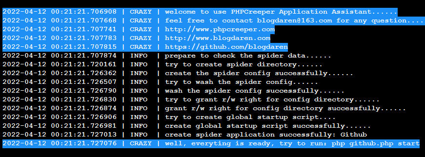

# PHPCreeper
<!--[]()-->
[]()
[]()
[]()
[]()
[]()
[](https://github.com/blogdaren/PHPCreeper/blob/master/LICENSE.txt)

## What is it

[PHPCreeper](http://www.phpcreeper.com) is a new generation of multi-process 
asynchronous event-driven spider engine based on [workerman](https://www.workerman.net).    

* Focus on efficient agile development, and make the crawler job become more easy   
* Solve the performance and scalability bottlenecks of traditional crawler frameworks

爬山虎是基于workerman开发的全新一代多进程异步事件驱动型PHP爬虫引擎, 它有助于：
* 专注于高效敏捷开发，让爬取工作变得更加简单.
* 解决传统型PHP爬虫框架的性能和扩展瓶颈问题.

## Documentation
The chinese document is relatively complete, and the english document will be kept up-to-date constantly here.   
**注意：** 爬山虎中文开发文档相对比较完善，各位小伙伴直接点击下方链接阅读即可.

* 爬山虎中文官方网站：[http://www.phpcreeper.com](http://www.phpcreeper.com)
* 中文开发文档主节点：[http://www.blogdaren.com/docs/](http://www.blogadren.com/docs/)
* 中文开发文档备节点：[http://www.phpcreeper.com/docs/](http://www.phpcreeper.com/docs/)
* **作者未涉足任何商业性资源和平台，全靠兴趣和热爱支撑，感谢小星星Star支持。**

## 技术交流
* 下方绿色二维码为VX交流群：&nbsp;phpcreeper 【群主热心、有问必答、进微信群需先加此专属微信并备注：爬山虎】  
* 微信群均围绕 [爬山虎引擎](http://www.phpcreeper.com) 和 [workerman](https://www.workerman.net/)
和 [深入PHP内核源码](https://www.bilibili.com/video/BV1pP4y1G7ae) 
开展技术交流，观看PHP内核系列视频请移步[B站](https://www.bilibili.com/video/BV1pP4y1G7ae)


## Screenshot


## Features
* Inherit almost all features from [workerman](https://www.workerman.net)
* Support Crontab-Jobs similar to Linux-Crontab
* Support distributed and separated deployment
* Support agile development with [PHPCreeper-Application](https://github.com/blogdaren/PHPCreeper-Application)
* Free to customize various callbacks and 3rd middleware
* Use PHPQuery as the elegant content extractor
* With high performance and strong scalability


## Prerequisites
* PHP_VERSION ≥ 7.0.0 (Better to choose PHP 7.2+ for some compatibility reasons)    
* A POSIX compatible OS (Linux、OSX、BSD)  
* POSIX &nbsp;extension for PHP (**Required**)
* PCNTL extension for PHP (**Required**)
* REDIS &nbsp;extension for PHP (Optional, note that `predis` will be the default redis client since v1.4.2)
* EVENT extension for PHP (Optional, it's strongly recommended to install for better performance)
* 简单的说：只要能跑起来workerman那就能跑起来PHPCreeper，所以安装要求和workerman完全一致。
* POSIX扩展和PCNTL扩展是必选项：PHP发行包一般都会默认安装这两个扩展，若没有请自行编译安装。
* EVENT扩展是可选项：建议最好安装，这是提升各路性能的一个主要支撑；另注意需要[优化Linux内核](https://www.workerman.net/doc/workerman/appendices/kernel-optimization.html)。
* REDIS扩展是可选项： **注意：v1.4.2版本之后，引擎默认采用predis客户端，所以不再强依赖REDIS扩展。**

## Installation
The recommended way to install PHPCreeper is through [Composer](https://getcomposer.org/).
```
composer require blogdaren/phpcreeper
```

## Usage: NOT Depend On The PHPCreeper Application Framework
Firstly, there is another matched Application Framework 
named [PHPCreeper-Application](https://github.com/blogdaren/PHPCreeper-Application) 
which is published simultaneously for your development convenience,
although this framework is not necessary, we strongly recommend that you use it
which will greatly improve your job efficiency. Besides, we can certainly write 
the code which **NOT** depends on the framework, it is also easy to make it.   

Next let's take an example to show how to capture the `github top 10 repos ranked by stars`：
```php
<?php 
require "./vendor/autoload.php";

use PHPCreeper\Kernel\PHPCreeper;
use PHPCreeper\Producer;
use PHPCreeper\Downloader;
use PHPCreeper\Parser;
use PHPCreeper\Timer;

//switch runtime language between `zh` and `en`, default is `zh`【version >= 1.3.7】
PHPCreeper::setLang('en');

//note that `predis` will be the default redis client since【version >= 1.4.2】
//but you could still switch it to be `redis` if you prefer to use ext-redis
//PHPCreeper::setDefaultRedisClient('redis');

//set default timezone, default is `Asia/Shanghai`【version >= 1.5.4】
//PHPCreeper::setDefaultTimezone('Asia/Shanghai');

//set master pid file manually as needed【version >= 1.3.8】
//PHPCreeper::setMasterPidFile('/path/to/master.pid');

//set worker log file when start as daemon mode as needed【version >= 1.3.8】
//PHPCreeper::setLogFile('/path/to/phpcreeper.log');

//enable the single worker mode so that we can run without redis, however, you should note 
//it will be limited to run only all the downloader workers in this case【version >= 1.3.2】
//PHPCreeper::enableMultiWorkerMode(false);


//Global-Redis-Config: support array value with One-Dimension or Two-Dimension, 
//SPECIAL NOTE: since v1.6.4, it's been upgraded to use a more secure and officially
//recommended distributed red lock mechanism by default, but it will use the
//old version of the lock mechanism degenerate only when all the redis instances 
//are explicitly configured with the option [use_red_lock === false] as below.
//for details on how to configure the value, refer to the Follow-Up sections.
$config['redis'] = [
    [
        'host'      =>  '127.0.0.1',
        'port'      =>  6379,
        'auth'      =>  false,
        'pass'      =>  'guest',
        'prefix'    =>  'PHPCreeper', 
        'database'  =>  '0',
        'connection_timeout' => 5,
        'read_write_timeout' => 0,
        //'use_red_lock'     => true,   //default to true since v1.6.4
    ],
];

//Global-Task-Config: the context member configured here is a global context,
//we can also set a private context for each task, finally the global context 
//and task private context will adopt the strategy of merging and covering.
//free to customize various context settings, including user-defined,
//for details on how to configure it, refer to the Follow-Up sections.
$config['task'] = array( 
    //'max_depth'       => 1,
    //'max_number'      => 1000,
    //'max_request'     => 1000,
    //'crawl_interval'  => 1,
    //'limit_domains'   => [],
    'context' => [
        'cache_enabled'   => false,
        'cache_directory' => '/tmp/DownloadCache4PHPCreeper/',
        //..................................................
    ],
); 

function startAppProducer()
{
    global $config;
    $producer = new Producer($config);

    $producer->setName('AppProducer')->setCount(1);
    $producer->onProducerStart = function($producer){
        //task private context
        $context = [];


        //【version <  1.6.0】: we mainly use an OOP style API to create task     
        //$producer->newTaskMan()->setXXX()->setXXX()->createTask()
        //$producer->newTaskMan()->setXXX()->setXXX()->createTask($task)
        //$producer->newTaskMan()->setXXX()->setXXX()->createMultiTask()
        //$producer->newTaskMan()->setXXX()->setXXX()->createMultiTask($task)


        //【version >= 1.6.0】: we provide a shorter and easier API to create task    
        //with more rich parameter types, and the old OOP style API can still be used,    
        //and extension jobs are promoted just to maintain backward compatibility
        //1. Single-Task-API: $task parameter types supported: [string | 1D-array]    
        //1. Single-Task-API：$producer->createTask($task);   
        //2. Multi-Task-API:  $task parameter types supported: [string | 1D-array | 2D-array]   
        //2. Multi-Task-API： $producer->createMultiTask($task);


        //use string: not recommended to use because the configuration is limited.    
        //so the question is that you need to process the fetching result by yourself     
        //$task = "https://github.com/search?q=stars:%3E1&s=stars&type=Repositories";
        //$producer->createTask($task);
        //$producer->createMultiTask($task);


        //use 1D-array：recommeded to use, rich configuration, engine helps to deal with all    
        $task = $_task = array(
            'url' => "https://github.com/search?q=stars:%3E1&s=stars&type=Repositories",
            "rule" => array(
                'title' => ['ul.repo-list div.f4.text-normal > a',      'text'],
                'stars' => ['ul.repo-list div.mr-3:nth-of-typ(1) > a',  'text'],
            ), 
            'rule_name' =>  '',       //it will use md5($task_id) as rule_name if leave empty  
            'refer'     =>  '',
            'type'      =>  'text',   //you can set the type freely on your demand
            'method'    =>  'get',
            "context"   =>  $context, //we can set a private context for each task individually
        );
        $producer->createTask($task);
        $producer->createMultiTask($task);

        //use 2D-array: recommed to use, rich configuration，engine helps to deal with all
        //since it is multitasking, only the createMultiTask() API can be called
        $task = array(
            array(
                'url' => "https://github.com/search?q=stars:%3E1&s=stars&type=Repositories",
                "rule" => array(
                    'title' => ['ul.repo-list div.f4.text-normal > a',      'text'],
                    'stars' => ['ul.repo-list div.mr-3:nth-of-typ(1) > a',  'text'],
                ), 
                //'rule_name' => 'r1', //it will use md5($task_id) as rule_name if leave empty
                "context" => $context,
            ),
            array(
                'url' => "https://github.com/search?q=stars:%3E1&s=stars&type=Repositories",
                "rule" => array(
                    'title' => ['ul.repo-list div.f4.text-normal > a',      'text'],
                    'stars' => ['ul.repo-list div.mr-3:nth-of-typ(1) > a',  'text'],
                ), 
                //'rule_name' => 'r2', //it will use md5($task_id) as rule_name if leave empty
                "context" => $context,
            ),
        );
        $producer->createMultiTask($task);

        //here is the old OOP style single-task-create API which you can continue to use
        $_task['url'] = "http://www.demo5.com";
        $producer->newTaskMan()->setUrl($_task['url'])->setRule($_task['rule'])
                 ->setContext($context)->createTask();

        //here is the old OOP style multi-task-create API which is not recommended to use
        $_task['url'] = "http://www.demo6.com";
        $producer->newTaskMan()->createMultiTask($_task);

        //we can also create task by opening an internal port 
        //for external communication with third-party applications
        /*
         *$server = new Server();
         *$server->setServerSocketAddress("text://0.0.0.0:3333");
         *$server->serve();
         *$server->onMessage = function($connection, $task)use($producer){
         *    $producer->createTask($task);
         *};
         */
    };
}

function startAppDownloader()
{
    global $config;
    $downloader = new Downloader($config);

    //set the client socket address based on the listening parser server 
    $downloader->setName('AppDownloader')->setCount(2)->setClientSocketAddress([
        'ws://127.0.0.1:8888',
    ]);

    $downloader->onBeforeDownload = function($downloader, $task){
        //disable http ssl verify in any of the following two ways 
        //$downloader->httpClient->disableSSL();
        //$downloader->httpClient->setOptions(['verify' => false]);
    }; 

    //some more downloader callbacks commonly used
    //$downloader->onDownloaderStart = function($downloader){};
    //$downloader->onDownloaderStop  = function($downloader){};
    //$downloader->onStartDownload = function($downloader, $task){};
    //$downloader->onAfterDownload = function($downloader, $download_data, $task){};
    //$downloader->onDownloaderMessage = function($downloader, $parser_reply){};
}

function startAppParser()
{
    $parser = new Parser();
    $parser->setName('AppParser')->setCount(1)->setServerSocketAddress('websocket://0.0.0.0:8888');
    $parser->onParserExtractField = function($parser, $download_data, $fields){
        pprint($fields);
    };

    //some more parser callbacks commonly used
    //$parser->onParserStart = function($parser){};
    //$parser->onParserStop  = function($parser){};
    //$parser->onParserMessage = function($parser, $connection, $download_data){};
    //$parser->onParserFindUrl = function($parser, $sub_url){};
}

//start producer instance
startAppProducer();

//start downloader instance
startAppDownloader();

//start parser instance
startAppParser();

//start phpcreeper
PHPCreeper::start();
```

## Usage: Depend On The PHPCreeper Application Framework
Now, let's do the same job based on the Application Framework:    


#### *Step-1：Download PHPCreeper-Application Framework*
```
git clone https://github.com/blogdaren/PHPCreeper-Application /path/to/myproject
```

#### *Step-2：Load the PHPCreeper Core Engine*

1、Switch to the application base directory:
```
cd /path/to/myproject
```

2、Load the PHPCreeper core engine:
```
composer require blogdaren/phpcreeper
```

#### *Step-3：Run PHPCreeper-Application Assistant*

1、Run PHPCreeper-Application assistant:
```
php  Application/Sbin/Creeper
```
2、The terminal output will look like this:    


#### *Step-4：Create One Application*

1、Create one spider application named **github**:
```
php Application/Sbin/Creeper make github --en
```

2、The complete execution process looks like this:   


As matter of fact, we have accomplished all the jobs at this point,
you just need to run `php github.php start` to see what has happened, 
but you still need to finish the rest step of the work if you wanna
do some elaborate work or jobs.

#### *Step-5：Business Configuration*
1、Switch to the application config direcory:
```
cd Application/Spider/Github/Config/
```
2、Edit the global config file named **global.php**:   
```
Normally, there is no need to change this file unless you wanna create a new global sub-config file
```
3、Edit the global sub-config file named **database.php**:
```php
<?php
return [
    'redis' => [
        'prefix' => 'Github',
        'host'   => '127.0.0.1',
        'port'   => 6379,
        'database' => 0,
    ],
];
```
or 
```php
<?php
return [
    'redis' => [[
        'prefix' => 'Github',
        'host'   => '127.0.0.1',
        'port'   => 6379,
        'database' => 0,
    ]],
];
```
4、Edit the global sub-config file named **main.php**:
```php
<?php
return array(
    //set the locale, currently support Chinese and English (optional, default `zh`)
    'language' => 'en',

    //PHPCreeper has two modes to work: single worker mode and multi workers mode,   
    //the former is seldomly to use, the only advantage is that you can play it   
    //without redis-server, because it uses the PHP built-in queue service, so it    
    //only applys to some simple jobs ; the latter is frequently used to handle    
    //many more complex jobs, especially for distributed or separated work or jobs,    
    //in this way, you must enable the redis server (optional, default `true`)
    'multi_worker'  => true,

    //whether to start the given worker(s) instance or not(optional, default `true`)
    'start' => array(
        'GithubProducer'      => true,
        'GithubDownloader'    => true,
        'GithubParser'        => true,
    ),

    //global task config
    'task' => array(
        //set the task crawl interval, the minimum 0.001 second (optional, default `1`)
        'crawl_interval'  => 1,

        //set the max crawl depth, 0 indicates no limit (optional, default `1`)
        'max_depth'       => 1,

        //set the max number of the task queue, 0 indicates no limit (optional, default `0`)
        'max_number'      => 1000,

        //set the max number of the request for each socket connection,  
        //if the cumulative number of socket requests exceeds the max number of requests,
        //the parser will close the connection and try to reconect automatically.
        //0 indicates no limit (optional, default `0`)
        'max_request'     => 1000,

        //compression algorithm
        'compress'  => array(
            //whether to enable the data compress method (optional, default `true`)
            'enabled'   =>  true,

            //compress algorithm, support `gzip` and `deflate` (optional, default `gzip`)
            'algorithm' => 'gzip',
        ),

        //limit domains which are allowed to crawl, no limit if leave empty
        'limit_domains' => array(
        ),

        //SPECIAL NOTE: the context member configured here is a global context,
        //we can also set a private context for each task individually,
        //it gives us a lot of flexibility to indirectly affect dependent services,
        //for example, various context parameters of HTTP requests can be affected 
        //by setting those context members (optional, default `null`).
        //the default HTTP engine is the Guzzle client, which supports all request 
        //parameters for Guzzle. See the Guzzle Manual for details.
        //SPECIAL NOTE: there are very few members which is not inconsistent with
        //Guzzle Official, so the inconsistencies will be annotated specifically.
        'context' => array(
            //whether to enable the downlod cache or not (optional, default `false`)
            'cache_enabled'   => false,                               

            //set the download cache directory (optional, default `sys_get_temp_dir()`)
            'cache_directory' => '/tmp/DownloadCache4PHPCreeper/', 

            //whether to allow capture the same URL resource repeatedly within a particular life cycle
            'allow_url_repeat' => true,

            //whether to trace the full HTTP request parameters not,  
            //the terminal will display the full request parameters if enabled
            'track_request_args' => true,

            //whether to trace the full task packet or not,  
            //the terminal will display the full task packet if enabled
            'track_task_package' => true,

            //before v1.6.0, it use md5($task_url) as rule_name if leave empty  
            //since v1.6.0, it will use md5($task_id) as rule_name if leave empty  
            //so this configuration parameter is only for backward compatibility, 
            //but it is not recommended because of the potential pitfalls.
            //in other words, if you are using an earlier version than v1.6.0, 
            //then you may need to enable this parameter. 
            'force_use_md5url_if_rulename_empty' => false,

            //force to use the older version of the multi-task creation API parameter style 
            //to maintain backward compatibility, but it is not recommendeded to use.
            'force_use_old_style_multitask_args' => false,

            //the format of cookies member is not different with the Guzzle Official, 
            //we shield up the cookieJar, the value maybe [false | array]
            'cookies' => [
                //'domain' => 'domain.com',
                //'k1' => 'v1',
                //'k2' => 'v2',
            ],  

            //set guzzle config membere here  
            //..............................

            //in addition to the built-in parameters, you can also configure user-defined parameters,
            //which are very useful in the upstream and downstream service chain application scenarios.
            'user_define_key1' => 'user_define_value1',
            'user_define_key2' => 'user_define_value2',
        ),
    ),

    //set the initialized task, support both Single-Task and Multi-Task
    'task_init' => array(
        'url' => 'https://github.com/search?q=stars:%3E1&s=stars&type=Repositories',

        //please refer to the "How to set extractor rule" section for details
        "rule" => array(
            'title' => ['ul.repo-list div.f4.text-normal > a',      'text'],
            'stars' => ['ul.repo-list div.mr-3:nth-of-typ(1) > a',  'text'],
        ),  

        //set rule name which will be set to `md5($task_id)` if leave it empty
        'rule_name' => 'r1',

        //set task private context
        'context'   => [],
    ),
);
```
5、Edit the business worker config file named **AppProducer.php**：
```php
<?php
return array(
    'name' => 'producer1',
    'count' => 1,
    'interval' => 1,
);
```

6、Edit the business worker config file named **AppDownloader.php**：
```php
<?php
return array(
    'name' => 'downloader1',
    'count' => 2,
    'socket' => array(
        'client' => array(
            'parser' => array(
                'scheme' => 'ws',
                'host' => '127.0.0.1',
                'port' => 8888,
            ),
        ),
    ),
);
```
7、Edit the business worker config file named **AppParser.php**：
```php
<?php
return array(
    'name'  => 'parser1',
    'count' => 3,
    'socket' => array(
        'server' => array(
            'scheme' => 'websocket',
            'host' => '0.0.0.0',
            'port' => 8888,
        ),
    ),
);
```
#### *Step-6：Write Business Callback*
1、Write business callback for AppProducer:
```php
<?php
public function onProducerStart($producer)
{
    //here we can add more new task(s) 
    //$producer->createTask($task);
    //$producer->createMultiTask($task);
}

public function onProducerStop($producer)
{
}

public function onProducerReload($producer)
{
}
``` 
2、Write business callback for AppDownloader:
```php
<?php
public function onDownloaderStart($downloader)
{
}

public function onDownloaderStop($downloader)
{
}

public function onDownloaderReload($downloader)
{
}

public function onDownloaderMessage($downloader, $parser_reply)
{
}

public function onBeforeDownload($downloader, $task)
{
    //here we can reset the $task and be sure to return it
    //$task = [...];
    //return $task;

    //here we can change the context parameters when creating a http request
    //$downloader->httpClient->setConnectTimeout(3);
    //$downloader->httpClient->setTransferTimeout(10);
    //$downloader->httpClient->setProxy('http://180.153.144.138:8800');
    //$downloader->httpClient->disableSSL();
}

public function onStartDownload($downloader, $task)
{
}

public function onAfterDownload($downloader, $download_data, $task)
{
    //here we can save the downloaded source data to a file
    //file_put_contents("/path/to/DownloadData.txt", $download_data);
}
```
3、Write business callback for AppParser:
```php
<?php
public function onParserStart($parser)
{
}

public function onParserStop($parser)
{
}

public function onParerReload($parser)
{
}

public function onParerMessage($parser, $connection, $download_data)
{
    //here we can view the current task
    //pprint($parser->task);
}

public function onParserFindUrl($parser, $url)
{
    //here we can check whether the sub url is valid or not
    //if(!Tool::checkUrl($url)) return false;
}

public function onParserExtractField($parser, $download_data, $fields)
{
    //here we got the expected data successfully extracted by rule
    //!empty($fields) && pprint($fields, __METHOD__);
    pprint($fields['r1']);

    //here we can save the business data into database like mysql、redis and so on
    //DB::save($fields);
}
```
#### *Step-7：Start Application Instance*
There are two ways to start an application instance, one is `Global Startup`, 
and the other is `Single Startup`, we just need to choose one of them.
`Global Startup` means that all workers run in the same group of processes under the same application,
it can be deployed in a distributed way, but it can't be deployed separately,
`Single Startup` means that different workers run in different groups of processes under the same application,
it can be distributed or deployed separately.

1、Or Global Startup:
```
php github.php start
```

2、Or Single Startup:
```
php Application/Spider/Github/AppProducer.php start
php Application/Spider/Github/AppDownloader.php start
php Application/Spider/Github/AppParser.php start
```

## How to set extractor rule
```php
//NOTE: this is new usage for【version >= v1.6.0】, strongly recommended to use.
$rule = array( 
    'field1' => ['selector', 'flag', 'range', 'callback'],
    .....................................................,
    'fieldN' => ['selector', 'flag', 'range', 'callback'],
);

//Single-Task
$task = array(
    'url'  => "http://www.weather.com.cn/weather/101010100.shtml",
    "rule" => $rule,
    'rule_name' =>  'r1',   
); 

//Multi-Task
$task = array(
    array(
        "url" => "http://www.weather.com.cn/weather/101010100.shtml",
        "rule" => $rule,
        'rule_name' => 'r1', 
        "context" => $context,
    ),
    array(
        "url" => "http://www.weather.com.cn/weather/201010100.shtml",
        "rule" => $rule,
        'rule_name' => 'r2', 
        "context" => $context,
    ),
);

```

* Per URL config item match a unique rule config item, and the ***rule_name*** must be one-to-one correspondence
* The type of rule value must be ***Array***
* For a single task, the depth of the corresponding rule item, that is, the depth of the array, can only be 2
* For multi task, the depth of the corresponding rule item, that is, the depth of the array, can only be 3

```php
//NOTE: this is outdated usage for【version < v1.6.0】, not recommended to use.
<?php
$urls = array(
    'rule_name1' => 'http://www.blogdaren.com';
    '..........' => '........................';
    'rule_nameN' => 'http://www.phpcreeper.com';
);

$rule = array( 
    'rule_name1' => array(
        'field1' => ['selector', 'flag', 'range', 'callback'],
        '......' => ['........', '....', '.....', '........'];
        'fieldN' => ['selector', 'flag', 'range', 'callback'],
    );
    .........................................................,
    'rule_nameN' => array(
        'field1' => ['selector', 'flag', 'range', 'callback'],
        '......' => ['........', '....', '.....', '........'];
        'fieldN' => ['selector', 'flag', 'range', 'callback'],
    );
);
```

+ **rule_name**  
you should give an unique rule name for each task, so that we can easily 
index the data that we want, if you leave it empty, it will use 
`md5($task_id)` not `md5($task_url)` which has potential pitfalls as the unique rule name since v1.6.0

+ **selector**  
selector must be provided, or it will be ignored, just like jQuery selector, its value can be like `#idName` or `.className` or `Html Element` 
and so on.

+ **flag**  
default value is `text`, indicates what action we should take, the value can be one of the following:    
`text`： used to get the text of html element    
`html`： used to get the html code snippets    
`attr`： used to get the attrbute value of html element     
　　　　【**Attention: the real value shoud be the attribute like `src`、`href` etc, NOT `attr` itself**】   
`css` ： &nbsp;used specially to get the style attribute of html element, and return as an array form   
　　　　【**Attention: support also more variant format like `css:*`、`css:prop1,prop2,...propN`**】   

+ **range**  
used to narrow down the entries to only those that match, just like jQuery selector, 
the value can be like `#idName` or `.className` or `Html Element` and so on.

+ **callback**  
you can trigger a `callback string` or `callback function` here, but remember to return the data expected.

    `callback string:`  it is semantically equivalent to the callback function, but it can only be of type string, **recommended to use**.   
    ~~`callback function:` PHP native callback function which may work unexpectedly in communication across multi-process environments, supported currently but **strongly NOT recommended to use and may be deprecated in the near future**.~~   


```php   
<?php
//extractor rule code example
$html = "<div><a href='http://www.phpcreeper.com' id='site' style='color:red;font-size:100px;'>PHPCreeper</a></div>";
$rule = array(
    'link_element'  => ['div',      'html'],
    'link_text '    => ['#site',    'text'],
    'link_address'  => ['a',        'href'],
    'link_css1'     => ['a',        'css'],
    'link_css2'     => ['div>a',    'css:font-size'],
    'callback_data' => ['#site',    'text', [], 'function($field_name, $data){
        return "Hello " . $data;
    }'], 
);  
$data = $parser->extractField($html, $rule, 'rule1');
pprint($data['rule1']);

//output
Array
(
    [0] => Array
        (
            [link_element] => <a href="http://www.phpcreeper.com" id="site" style="color:red;font-size:100px;">PHPCreeper</a>
            [link_text ] => PHPCreeper
            [link_address] => http://www.phpcreeper.com
            [link_css1] => Array
                (
                    [color] => red
                    [font-size] => 100px
                )

            [link_css2] => Array
                (
                    [font-size] => 100px
                )

            [callback_data] => Hello PHPCreeper
        )

)
```

## Use Database
PHPCreeper wrappers a lightweight database like Medoo style, 
please visit the [Medoo official site](https://medoo.lvtao.net/) 
if you wanna know more about its usage. now we just need to find out 
how to get the DBO, as a matter of fact, it is very simple:   

First configure the `database.php` then add the code listed below:
```php
<?php
return array(
    'dbo' => array(
        'test' => array(
            'database_type' => 'mysql',
            'database_name' => 'test',
            'server'        => '127.0.0.1',
            'username'      => 'root',
            'password'      => 'root',
            'charset'       => 'utf8'
        ),
    ),
);
```

Now we can get DBO and start the query or the other operation as you like: 
```php
<?php
$downloader->onAfterDownloader = function($downloader){
    //dbo single instance and we can pass the DSN string `test`
    $downloader->getDbo('test')->select('title', '*');
    
    //dbo single instance and we can pass the configuration array
    $config = Configurator::get('globalConfig/database/dbo/test')
    $downloader->getDbo($config)->select('title', '*');

    //dbo new instance and we can pass the DSN string `test`
    $downloader->newDbo('test')->select('title', '*');

    //dbo new instance and we can pass the configuration array
    $config = Configurator::get('globalConfig/database/dbo/test')
    $downloader->newDbo($config)->select('title', '*');
};
```

## Available commands
Note that all the commands in `PHPCreeper` can only run on the command line, 
and you must write a global entry startup script whose name
assumed to be `AppWorker.php` before you start any crawling jobs, but if you use the 
`PHPCreeper-Application` framework for your development, it will automatically 
help you generate all the startup scripts including global we need.

```
php AppWorker.php start
```

```
php AppWorker.php start -d
```

```
php AppWorker.php stop
```

```
php AppWorker.php restart
```

```
php AppWorker.php reload
```

```
php AppWorker.php reload -g
```

```
php AppWorker.php status
```

```
php AppWorker.php connections
```

## Related links and thanks

* [http://www.phpcreeper.com](http://www.phpcreeper.com)
* [http://www.blogdaren.com](http://www.blogdaren.com)
* [https://www.workerman.net](https://www.workerman.net)

## Donate
As a free worker, if you think [PHPCreeper](http://www.phpcreeper.com) is valuable to you and benefit from it, 
I'm willing to accept donations from all sides. Thanks a lot.

* By PayPal.me：[PHPCcreeper.paypal.me](https://paypal.me/phpcreeper)
* By Alipay or Wechat：    

&nbsp;&nbsp;&nbsp;&nbsp;


## LICENSE
[PHPCreeper](http://www.phpcreeper.com) is released under the [MIT License](https://github.com/blogdaren/PHPCreeper/blob/master/LICENSE.txt).   

## DISCLAIMER
Please **DON'T** use PHPCreeper for businesses which are **NOT PERMITTED BY LAW** in your country. 
I take no warranty or responsibility for this code. Use at your own risk.

## 友情链接
* 致谢workerman官方：[workerman](https://www.workerman.net)
* 协程版workerman：[WarriorMan](https://github.com/zyfei/WarriorMan)


