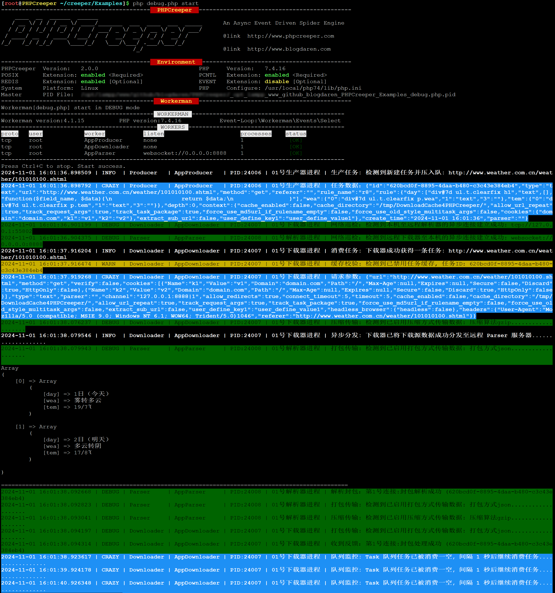

# PHPCreeper
<!--[]()-->
[]()
[]()
[]()
[]()
[]()
[](https://github.com/blogdaren/PHPCreeper/blob/master/LICENSE.txt)

## What is it

[PHPCreeper](http://www.phpcreeper.com) is a new generation of multi-process 
asynchronous event-driven spider engine based on [workerman](https://www.workerman.net).    

* Focus on efficient agile development, and make the crawler job become more easy   
* Solve the performance and scalability bottlenecks of traditional crawler frameworks
* Take advantage of crawling fully in Multi-Process + Distributed + Separated environment
* Support headless browser which can execute JavaScript codes for crawling dynamic pages 

爬山虎是基于workerman开发的全新一代多进程异步事件驱动型PHP爬虫引擎, 它有助于：
* 专注于高效敏捷开发，让爬取工作变得更加简单。
* 解决传统型PHP爬虫框架的性能和扩展瓶颈问题。
* 充分发挥多进程+分布式+分离式部署环境下的爬取优势。
* 支持无头浏览器即支持运行JavaScript代码及其渲染页。

## Documentation
The chinese document is relatively complete, and the english document will be kept up-to-date constantly here.   
**注意：** 爬山虎中文开发文档相对比较完善，各位小伙伴直接点击下方链接阅读即可.

* 爬山虎中文官方网站：[http://www.phpcreeper.com](http://www.phpcreeper.com)
* 中文开发文档主节点：[http://www.phpcreeper.com/docs/](http://www.phpcreeper.com/docs/)
* 中文开发文档备节点：[http://www.blogdaren.com/docs/](http://www.blogdaren.com/docs/)
* **爬山虎是一个免费开源的佛系爬虫项目，欢迎小星星Star支持，让更多的人发现、使用并受益。**
* **爬山虎源码根目录下有一个`Examples/start.php`样例脚本，开发之前建议先阅读它而后运行它。**
* **爬山虎提供的例子如果未能按照预期工作，请检查修改爬取规则，因为源站DOM极可能更新了。**

## 技术交流
* 下方绿色二维码为微信交流群：phpcreeper 【进群之前需先加此专属微信并备明来意或附上备注：爬山虎】  
* [《深入PHP内核源码》](https://item.taobao.com/item.htm?ft=t&id=719914277319)原创视频的配套文档是作者一个字一个字随堂认真敲写而来，文字总数高达近30000字，并且附有大量自绘原创插图，所以如果你是通过workerman社区或github站或B站或V站联系到本人，计划在视频录制结束并二次完善文档之后的合适时间**免费赠予有缘小伙伴**，[点此观看视频配套文档和完整目录章节视频 ](https://www.bilibili.com/video/BV1RH6VYqEYA/)。
* 微信群主要围绕 [爬山虎](http://www.phpcreeper.com) 和 [workerman](https://www.workerman.net/)
和 [深入PHP内核源码](https://item.taobao.com/item.htm?ft=t&id=719914277319) 
开展技术交流，观看PHP内核源码视频请移步至[B站](https://www.bilibili.com/video/BV1pP4y1G7ae)。

<p align="center">
  
</p>


## Screenshot


## Features
* Inherit almost all features from [workerman](https://www.workerman.net)
* Support headless browser for crawling dynamic pages
* Support router to different parser by the task type
* Support Crontab-Jobs similar to Linux-Crontab
* Support distributed and separated deployment
* Support agile development with [PHPCreeper-Application](https://github.com/blogdaren/PHPCreeper-Application)
* Use PHPQuery as the elegant content extractor
* With high performance and strong scalability


## Prerequisites
* PHP_VERSION ≥ 7.0.0 (Better to choose PHP 7.4+ for some compatibility reasons)    
* A POSIX compatible OS (Linux、Mac、BSD)  
* POSIX &nbsp;extension for PHP (**Required**)
* PCNTL extension for PHP (**Required**)
* REDIS &nbsp;extension for PHP (Optional, note that `predis` will be the default redis client since v1.4.2)
* EVENT extension for PHP (Optional, it's strongly recommended to install for better performance)
* 简单的说：只要能跑起来workerman那就能跑起来PHPCreeper，所以安装要求和workerman完全一致。
* POSIX扩展和PCNTL扩展是必选项：PHP发行包一般都会默认安装这两个扩展，若没有请自行编译安装。
* EVENT扩展是可选项：建议最好安装，这是提升各路性能的一个主要支撑；另注意需要[优化Linux内核](https://www.workerman.net/doc/workerman/appendices/kernel-optimization.html)。
* REDIS扩展是可选项： **注意：v1.4.2版本之后，引擎默认采用predis客户端，所以不再强依赖REDIS扩展。**

## Installation
The recommended way to install PHPCreeper is through [Composer](https://getcomposer.org/).
```
composer require blogdaren/phpcreeper
```

## Usage: NOT Depend On The PHPCreeper Application Framework
Firstly, there is another matched Application Framework 
named [PHPCreeper-Application](https://github.com/blogdaren/PHPCreeper-Application) 
which is published simultaneously for your development convenience,
although this framework is not necessary, we strongly recommend that you use it
which will greatly improve your job efficiency. Besides, we can also write 
the code which **NOT** depends on the framework, it is also easy to make it.   

Next let's take an example to show how to `capture the weather in Washington in 7 days`：([**See Full Demo Here**](/Docs/FullDemo.md))

```php
<?php 
//Note: if this example provided by the PHPCreeper does not work as expected, 
//check to modify the crawl rules, as the source DOM is most likely updated.
require "./vendor/autoload.php";

use PHPCreeper\PHPCreeper;
use PHPCreeper\Producer;
use PHPCreeper\Downloader;
use PHPCreeper\Parser;
use PHPCreeper\Server;
use PHPCreeper\Crontab;
use PHPCreeper\Timer;

//switch runtime language between `zh` and `en`, default is `zh`【version >= 1.3.7】
PHPCreeper::setLang('en');

//enable the single worker mode so that we can run without redis, however, you should note 
//it will be limited to run only all the downloader workers in this case【version >= 1.3.2】
//PHPCreeper::enableMultiWorkerMode(false);

//set master pid file manually as needed【version >= 1.3.8】
//PHPCreeper::setMasterPidFile('/path/to/master.pid');

//set worker log file when start as daemon mode as needed【version >= 1.3.8】
//PHPCreeper::setLogFile('/path/to/phpcreeper.log');

//note that `predis` will be the default redis client since【version >= 1.4.2】
//but you could still switch it to be `redis` if you prefer to use ext-redis
//PHPCreeper::setDefaultRedisClient('redis');

//set default timezone, default is `Asia/Shanghai`【version >= 1.5.4】
//PHPCreeper::setDefaultTimezone('Asia/Shanghai');

//redirect all stdandard out to file when run as daemonize【version >= 1.7.0】
//PHPCreeper::setStdoutFile("/path/to/stdout.log");

//set default headless browser, default is `chrome`【version >= 1.8.7】
//PHPCreeper::setDefaultHeadlessBrowser('chrome');

//if the child process don't exit within timeout, then force to kill it【version >= 2.0.0】
//PHPCreeper::setChildProcessStopTimeout(5);

//Global-Redis-Config: support array value with One-Dimension or Two-Dimension, 
//NOTE: since v1.6.4, it's been upgraded to use a more secure and officially
//recommended distributed red lock mechanism by default, but it will use the
//old version of the lock mechanism degenerate only when all the redis instances 
//are explicitly configured with the option [use_red_lock === false] as below.
//for details on how to configure the value, refer to the Follow-Up sections.
$config['redis'] = [
    [
        'host'      =>  '127.0.0.1',
        'port'      =>  6379,
        'database'  =>  '0',
        'auth'      =>  false,
        'pass'      =>  'guest',
        'prefix'    =>  'PHPCreeper', 
        'connection_timeout' => 5,
        'read_write_timeout' => 0,
        'use_red_lock'       => true,   
    ],
];

//Global-Task-Config: the context member configured here is a global context,
//we can also set a private context for each task, finally the global context 
//and private task context will adopt the strategy of merging and covering.
//you can free to customize various context settings, including user-defined,
//for details on how to configure it, please refer to the Follow-Up sections.
$config['task'] = [ 
    'context' => [
        'cache_enabled'    => true,
        'cache_directory'  => sys_get_temp_dir() . '/DownloadCache4PHPCreeper/',
        'allow_url_repeat' => true,
        'headless_browser' => ['headless' => false],
    ],
]; 

function startAppProducer()
{
    global $config;
    $producer = new Producer($config);

    $producer->setName('AppProducer')->setCount(1);
    $producer->onProducerStart = function($producer){
        //private task context which will be merged with global context
        $private_task_context = [];

        //use 1D-array：we can use either `createTask()` or `createMultiTask()` API
        $task = array(
            'url'  => "https://forecast.weather.gov/MapClick.php?lat=47.4113&lon=-120.5563",
            'rule' => [       
                'period'      => ['#seven-day-forecast-container ul li p.period-name', 'text'],
                'weather'     => ['#seven-day-forecast-container ul li p.short-desc', 'text'],
                'temperature' => ['#seven-day-forecast-container ul li p.temp', 'text'],
            ],
            'rule_name' =>  '',       //md5($task_id) will be the rule_name if leave empty  
            'refer'     =>  '',
            'type'      =>  'text',   //it has lost the original concept setting, feel free to use 
            'method'    =>  'get',
            'parser'    =>  '',       //router to one random target parser if leave empty [ip:port]  
            "context"   =>  $private_task_context, 
        );
        $producer->createTask($task);

        //use 2D-array: we can only use the `createMultiTask()` API for multask 
        $task = array(
            array(
                'url'  => "https://forecast.weather.gov/MapClick.php?lat=47.4113&lon=-120.5563",
                'rule' => [       
                    'period'      => ['#seven-day-forecast-container ul li p.period-name', 'text'],
                    'weather'     => ['#seven-day-forecast-container ul li p.short-desc', 'text'],
                    'temperature' => ['#seven-day-forecast-container ul li p.temp', 'text'],
                ],
                'rule_name' => 'r1',
                "context"   => $private_task_context,
            ),
            array(
                'url'  => "https://forecast.weather.gov/MapClick.php?lat=47.4113&lon=-120.5563",
                'rule' => [       
                    'period'      => ['#seven-day-forecast-container ul li p.period-name', 'text'],
                    'weather'     => ['#seven-day-forecast-container ul li p.short-desc', 'text'],
                    'temperature' => ['#seven-day-forecast-container ul li p.temp', 'text'],
                ],
                'rule_name' => 'r2', 
                "context"   => $private_task_context,
            ),
        );
        $producer->createMultiTask($task); 

        //use headless browser to crawl dynamic page rendered by javascript
        $private_task_context['headless_browser']['headless'] = true;
        $dynamic_task = array(
            'url' => 'https://www.toutiao.com',
            'rule' => array(
                'title' => ['div.show-monitor ol li a', 'aria-label'],
                'link'  => ['div.show-monitor ol li a', 'href'],
            ), 
            'context' => $private_task_context,
        );
        $producer->createTask($dynamic_task);
    };
}

function startAppDownloader()
{
    global $config;
    $downloader = new Downloader($config);

    //set the client socket address based on the listening parser server 
    $downloader->setName('AppDownloader')->setCount(2)->setClientSocketAddress([
        'ws://127.0.0.1:8888',
    ]);

    $downloader->onDownloadBefore = function($downloader, $task){
        //disable http ssl verify in any of the following two ways 
        //$downloader->httpClient->disableSSL();
        //$downloader->httpClient->setOptions(['verify' => false]);
    }; 

    //more downloader or download callbacks frequently used
    //$downloader->onDownloaderStart = function($downloader){};
    //$downloader->onDownloaderStop  = function($downloader){};
    //$downloader->onDownloaderMessage = function($downloader, $parser_reply){};
    //$downloader->onDownloaderConnectToParser = function($connection){};
    //$downloader->onDownloadStart = function($downloader, $task){};
    //$downloader->onDownloadAfter = function($downloader, $download_data, $task){};
    //$downloader->onDownloadFail  = function($downloader, $error, $task){};
    //$downloader->onDownloadTaskEmpty = function($downloader){};
    //$downloader->onHeadlessBrowserOpenPage = function($downloader, $browser, $page, $url){};
}

function startAppParser()
{
    $parser = new Parser();
    $parser->setName('AppParser')->setCount(1)->setServerSocketAddress('websocket://0.0.0.0:8888');
    $parser->onParserExtractField = function($parser, $download_data, $fields){
        pprint($fields);
    };

    //more parser callbacks frequently used
    //$parser->onParserStart = function($parser){};
    //$parser->onParserStop  = function($parser){};
    //$parser->onParserMessage = function($parser, $connection, $download_data){};
    //$parser->onParserFindUrl = function($parser, $sub_url){};
}

function startAppServer()
{
    $server = new Server();
    $server->onServerStart = function(){
        //execute the task every 1 second
        new Crontab('*/1 * * * * *', function(){
            pprint("print the current time every 1 second: " . time());
        });

        //execute the task every 2 minutes 
        new Crontab('*/2 * * * *', function(){
            pprint("print the current time every 2 minutes: " . time());
        });
    };
}

//start producer component
startAppProducer();

//start downloader component
startAppDownloader();

//start parser component 
startAppParser();

//start server component
startAppServer();

//start phpcreeper engine
PHPCreeper::start();
```

Now, save the example code above to a file and name it to be `weather.php` as a startup script, then run it like this:
```
/path/to/php weather.php start
```

## Usage: Depend On The PHPCreeper Application Framework
If u wanna develop the app based on the `PHPCreeper Application Framework` or `see more configuration`，[click here](/Docs/)

## How to set extractor rule
```php
//NOTE: this is new usage for【version >= v1.6.0】, strongly recommended to use.
$rule = array( 
    'field1' => ['selector', 'action', 'range', 'callback'],
    .....................................................,
    'fieldN' => ['selector', 'action', 'range', 'callback'],
);

//Single-Task
$task = array(
    'url'  => "https://forecast.weather.gov/MapClick.php?lat=47.4113&lon=-120.5563",
    'rule' => $rule,
    'rule_name' =>  'r1',   
); 

//Multi-Task
$task = array(
    array(
        'url'  => "https://forecast.weather.gov/MapClick.php?lat=47.4113&lon=-120.5563",
        'rule' => $rule,
        'rule_name' => 'r1', 
        "context" => $context,
    ),
    array(
        'url'  => "https://forecast.weather.gov/MapClick.php?lat=47.4113&lon=-120.5563",
        'rule' => $rule,
        'rule_name' => 'r2', 
        "context" => $context,
    ),
);

```

> Per URL config item match a unique rule config item, and the ***rule_name*** must be one-to-one correspondence

> Note the type of rule value must be ***Array***

> For a single task, the depth of the corresponding rule item, that is, the depth of the array, can only be 2

> For multi task, the depth of the corresponding rule item, that is, the depth of the array, can only be 3


+ **rule_name**  
you should give an unique rule name for each task, so that we can easily 
index the data that we want, if you leave it empty, it will use 
`md5($task_id)` not `md5($task_url)` which has potential pitfalls as the unique rule name since v1.6.0

+ **selector**  
selector must be provided, or it will be ignored, just like jQuery selector, its value can be like `#idName` or `.className` or `Html Element` 
and so on.

+ **action**  
default value is `text`, indicates what action we should take, the value can be one of the following:    
`text`： used to get the inner text of html element    
`html`： used to get the inner text with tags of html element    
`attr`： used to get the attrbute value of html element     
　　　　【**Attention: the real value shoud be the attribute like `src`、`href` etc, NOT `attr` itself**】   
`css` ： &nbsp;used specially to get the style attribute of html element, and return as an array form   
　　　　【**Attention: support also more variant format like `css:*`、`css:prop1,prop2,...propN`**】   

+ **range**  
used to narrow down the entries to only those that match, just like jQuery selector, 
the value can be like `#idName` or `.className` or `Html Element` and so on.

+ **callback**  
you can trigger a `callback string` or `callback function` here, but remember to return the data expected.

  `callback string:`  it is recommended to use and semantically equivalent to the PHP native callback function.   
  `callback function:` note that you should use `callback string` instead of ~~`callback function`~~, because PHP native callback function may work unexpectedly in communication across multi-process environments.   


```php   
<?php
//extractor rule code example
$html = "<div><a href='http://www.phpcreeper.com' id='site' style='color:red;font-size:100px;'>PHPCreeper</a></div>";
$rule = array(
    'link_element'  => ['div',      'html'],
    'link_text '    => ['#site',    'text'],
    'link_address'  => ['a',        'href'],
    'link_css1'     => ['a',        'css'],
    'link_css2'     => ['div>a',    'css:font-size'],
    'callback_data' => ['#site',    'text', [], 'function($field_name, $data){
        return "Hello " . $data;
    }'], 
);  
$data = $parser->extractField($html, $rule, 'rule1');
pprint($data['rule1']);

//output
Array
(
    [0] => Array
        (
            [link_element] => <a href="http://www.phpcreeper.com" id="site" style="color:red;font-size:100px;">PHPCreeper</a>
            [link_text ] => PHPCreeper
            [link_address] => http://www.phpcreeper.com
            [link_css1] => Array
                (
                    [color] => red
                    [font-size] => 100px
                )

            [link_css2] => Array
                (
                    [font-size] => 100px
                )

            [callback_data] => Hello PHPCreeper
        )

)
```

## Use Database
PHPCreeper wrappers a lightweight database like Medoo style, 
please visit the [Medoo official site](https://medoo.lvtao.net/) 
if you wanna know more about its usage. now we just need to find out 
how to get the DBO, as a matter of fact, it is very simple:   

First configure the `database.php` then add the code listed below:
```php
<?php
return array(
    'dbo' => array(
        'test' => array(
            'database_type' => 'mysql',
            'database_name' => 'test',
            'server'        => '127.0.0.1',
            'username'      => 'root',
            'password'      => 'root',
            'charset'       => 'utf8'
        ),
    ),
);
```

Now we can get DBO and start the query or the other operation as you like: 
```php
<?php
$downloader->onAfterDownloader = function($downloader){
    //dbo single instance and we can pass the DSN string `test`
    $downloader->getDbo('test')->select('title', '*');
    
    //dbo single instance and we can pass the configuration array
    $config = Configurator::get('globalConfig/database/dbo/test')
    $downloader->getDbo($config)->select('title', '*');

    //dbo new instance and we can pass the DSN string `test`
    $downloader->newDbo('test')->select('title', '*');

    //dbo new instance and we can pass the configuration array
    $config = Configurator::get('globalConfig/database/dbo/test')
    $downloader->newDbo($config)->select('title', '*');
};
```

## Available commands
Note that all the commands in `PHPCreeper` can only run on the command line, 
and you must write a global entry startup script whose name
assumed to be `start.php` before you start any crawling jobs, but if you use the 
`PHPCreeper-Application` framework for your development, it will automatically 
help you generate all the startup scripts including global we need.

```
php start.php start
```

```
php start.php start -d
```

```
php start.php stop
```

```
php start.php restart
```

```
php start.php reload
```

```
php start.php reload -g
```

```
php start.php status
```

```
php start.php connections
```

## Related links and thanks

* [http://www.phpcreeper.com](http://www.phpcreeper.com)
* [http://www.blogdaren.com](http://www.blogdaren.com)
* [https://www.workerman.net](https://www.workerman.net)

## LICENSE
[PHPCreeper](http://www.phpcreeper.com) is released under the [MIT License](https://github.com/blogdaren/PHPCreeper/blob/master/LICENSE.txt).   

## DISCLAIMER
Please **DON'T** use PHPCreeper for any businesses which are **NOT PERMITTED BY LAW** in your country.    
Please comply with the spider protocol for friendly use of PHPCreeper, if you choose to use PHPCreeper,    
you will comply with this agreement. I take no warranty or responsibility for this code. Use at your own risk.
