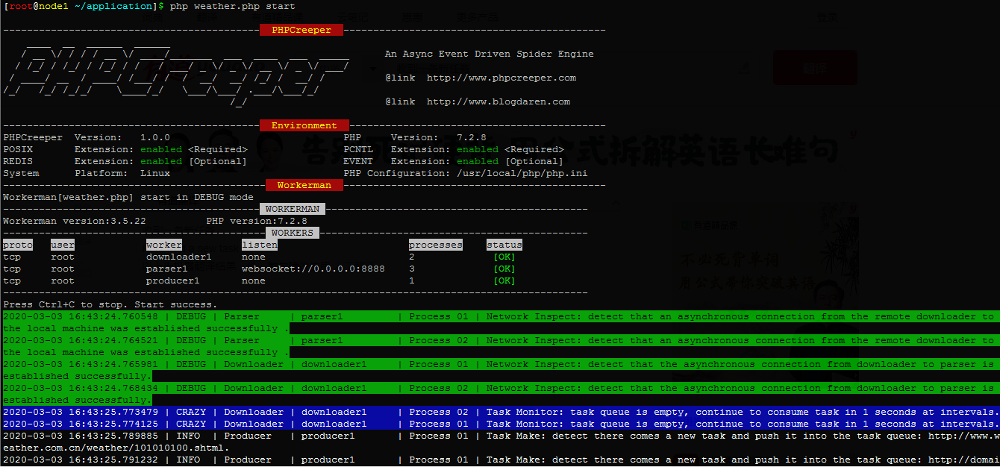
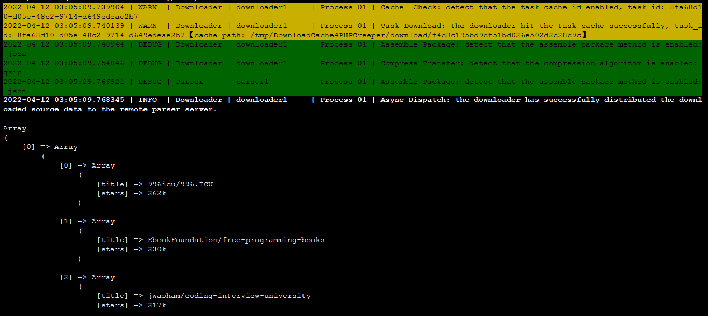
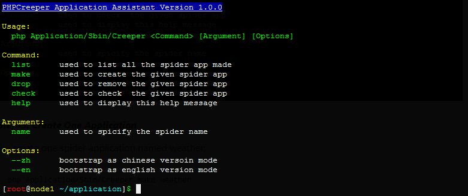
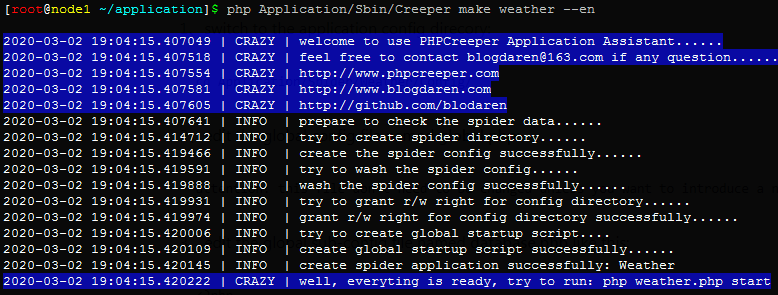

# PHPCreeper
[]()
[]()
[]()
[]()
[]()
[]()
[]()

## What is it

[PHPCreeper](http://www.phpcreeper.com) is a new generation of multi-process 
asynchronous event-driven spider engine based on [Workerman](https://www.workerman.net)

## Documentation
The chinese document is relatively complete, and the english document will be kept up-to-date constantly here.   
**注意：** 爬山虎中文开发文档相对比较完善，中国朋友直接点击下方链接阅读即可.

* 爬山虎中文官方网站：[http://www.phpcreeper.com](http://www.phpcreeper.com)
* 中文开发文档主节点：[http://www.blogdaren.com/docs/](http://www.blogadren.com/docs/)
* 中文开发文档备节点：[http://www.phpcreeper.com/docs/](http://www.phpcreeper.com/docs/)

## Screenshot



## Todo List
- [x] 轻量级关系型数据库：Lightweight relational database like Medoo style
- [ ] 反爬之IP生态代理池：&nbsp;IP ecological agent pool of Anti-Spider strategy
- [ ] 图片验证码识别技术：Image verification code recognition technology
- [ ] 智能化识别网页数据：Intelligent recognition of the web page content
- [ ] 爬虫项目管理可视化：The crawler application management visualization

## Motivation
Nowadays, there are all kinds of language version of the spider frameworks which have been born, such as: 
`Spiderman based on Java`、`Scrapy based on Python`、`go-colly based on Go` etc. However, we also need to realize that：    

As we are faced with business scenarios like crawler jobs where any language is appropriate, 
no matter whether you are a novice or a PHP preconceived master who is not so familiar with 
other programming languages, we strongly recommend that you should give priority to an excellent spider 
engine written in PHP. So why? Because PHP is absolutely optimal for agility, and you can play PHP with ease, 
and it could be much more expensive to use some other languages, and it can reduce the development costs for you 
or your company in a straight line and so on.

Besides, as far as I know, almost all of the PHP spider frameworks work as either single-process or synchronous mode, 
neither distributed nor separate deployment is supported, so crawler performance couldn't be maximized. 
Today `PHPCreeper` makes everything possible.


So `PHPCreeper` is mainly designed to：     

* Focus on efficient agile development, and make the crawling job become more easy   
* Solve the performance and extension problems of traditional PHP crawler frameworks    


## Features
* Inherit all features from workerman
* Free to customize various plugins and callback
* Free to customize the third-party middleware
* Support for netflow traffic limitaion
* Support for distributed deployment
* Support for separated deployment
* Support for socket programming
* Support multi-language environment
* Use PHPQuery as the elegant content extractor
* Support for agile development with PHPCreeper-Application
* With high performance and strong scalability
* With rich and human-readable development documents 


## Prerequisites
* PHP_VERSION \>= 7.0.0     
* A POSIX compatible operating system (Linux、OSX、BSD)  
* POSIX &nbsp;extension for PHP (**required**)
* PCNTL extension for PHP (**required**)
* REDIS &nbsp;extension for PHP (optional, strongly recommend to install)
* EVENT extension for PHP (optional, better to install)

## Installation
The recommended way to install PHPCreeper is through [Composer](https://getcomposer.org/).
```
composer require blogdaren/phpcreeper
```

## Usage: not depend on the application framework
Firstly, we should know there is another official matched application framework 
named [PHPCreeper-Application](https://github.com/blogdaren/PHPCreeper-Application) 
which is published simultaneously for your development convenience,
although this framework is not necessary, we strongly recommend that you use it for 
business development, thus it's no doubt that it will greatly improve your job efficiency.
However, somebody still wish to write the code which not depends on the framework, it is 
also easy to make it.   

Assume we wanna capture the weather forecasts for the next 7 days, now let's take an example to illustrate the usage:
```php
<?php 
require "./vendor/autoload.php";

use PHPCreeper\Kernel\PHPCreeper;
use PHPCreeper\Producer;
use PHPCreeper\Downloader;
use PHPCreeper\Parser;

//uncomment the line below to enable the single worker mode if you want to run without redis
//PHPCreeper::$isRunAsMultiWorker = false;

//producer instance
$producer = new Producer;
$producer->setName('AppProducer')->setCount(1);
$producer->onProducerStart = function($producer){
    //task can be configured like this, here the rule name like `r1` should be given:
    $task = array(
        'url' => array(
            "r1" => "http://www.weather.com.cn/weather/101010100.shtml",
        ),
        'rule' => array(
            "r1" => array(
                'time' => ['div#7d ul.t.clearfix h1',      'text'],
                'wea'  => ['div#7d ul.t.clearfix p.wea',   'text'],
                'tem'  => ['div#7d ul.t.clearfix p.tem',   'text'],
                'wind' => ['div#7d ul.t.clearfix p.win i', 'text'],
            ), 
        ),
    );

    //task can also be configured like this, here `md5($url)` will be the rule name:
    $task = array(
        'url' => array(
            "http://www.weather.com.cn/weather/101010100.shtml",
        ),
        'rule' => array(
            array(
                'time' => ['div#7d ul.t.clearfix h1',      'text'],
                'wea'  => ['div#7d ul.t.clearfix p.wea',   'text'],
                'tem'  => ['div#7d ul.t.clearfix p.tem',   'text'],
                'wind' => ['div#7d ul.t.clearfix p.win i', 'text'],
            ), 
        ),
    );

    //various context settings
    $context = array(
        //'cache_enabled'   => true,                              
        //'cache_directory' => '/tmp/task/download/' . date('Ymd'), 
        //..........................
    );

    //we can call `createMultiTask()` for multi tasks: 
    $producer->newTaskMan()->setContext($context)->createMultiTask($task);

    //we can also call `createTask()` for single task: 
    $producer->newTaskMan()->setUrl($task['url'])->setRule($task['rule'])->createTask();
};

//downloader instance
$downloader = new Downloader();
$downloader->setName('AppDownloader')->setCount(2)->setClientSocketAddress([
    'ws://127.0.0.1:8888',
]);

//parser instance
$parser = new Parser();
$parser->setName('AppParser')->setCount(1)->setServerSocketAddress('websocket://0.0.0.0:8888');
$parser->onParserExtractField = function($parser, $download_data, $fields){
    pprint($fields);
};

//start phpcreeper
PHPCreeper::start();
```

## Usage: depend on the application framework
Next, let's use the official application framework to complete the same task above efficiently:    


#### *Step-1：Download PHPCreeper-Application Framework*
```php
git clone https://github.com/blogdaren/PHPCreeper-Application
```

#### *Step-2：Load the PHPCreeper Core Engine*

1、Switch to the PHPCreeper-Application base directory:
```php
cd /path/to/PHPCreeper-Application
```

2、Load the PHPCreeper core engine:
```php
composer require blogdaren/phpcreeper
```

#### *Step-3：Run PHPCreeper-Application Assistant*

1、Run PHPCreeper-Application assistant:
```php
php  Application/Sbin/Creeper

```
2、The terminal output will look like this:    



 #### *Step-4：Create One Application*
1、Create one spider application named **weather**:
```
php Application/Sbin/Creeper make weather --en
```
2、The full process of building looks like this:   



As matter of fact, we have accomplished all the jobs at this point,
you just need to run `php weather.php start` to see what has happened, 
but you still need to finish the rest step of the work if you wanna
do some elaborate work or jobs.

#### *Step-5：Business Configuration*
1、Switch to the application config direcory:
```
cd Application/Spider/Weather/Config/
```
2、Edit the global config file named **global.php**:   
```
ATTENTION: don't change this file unless you want to introduce a new global sub-config file
```
3、Edit the global sub-config file named **database.php** like this:
```php
<?php
return array(
    'redis' => array(
        'prefix' => 'Weather',
        'host'   => '127.0.0.1',
        'port'   => 6379,
        'database' => 0,
    ),
);
```
4、Edit the global sub-config file named **main.php** like this:
```php
return array(
    //set the locale, currently support Chinese and English (optional, default `zh`)
    'language' => 'en',

    //phpcreeper has two modes to work: single worker mode and multi workers mode
    //the former is seldomly to use, only applys to some simple jobs, now you have 
    //the chance to use the built-in php queue service without redis; the latter 
    //is frequently to use to handle many more complex jobs, especially distributed,
    //in this way, you must enable the redis server (optional, default `true`)
    'multi_worker'  => true,

    //whether to boot any worker instance you want (optional, default `true`)
    'start' => array(
        'WeatherProducer'      => true,
        'WeatherDownloader'    => true,
        'WeatherParser'        => true,
    ),

    'task' => array(
        //set http request method (optional, default `get`)
        'method'          => 'get', 

        //set the task crawl interval, the minimum 0.001 second (optional, default `1`)
        'crawl_interval'  => 1,

        //set the max crawl depth, 0 indicates no limit (optional, default `1`)
        'max_depth'       => 1,

        //set the max number of the task queue, 0 indicates no limit (optional, default `0`)
        'max_number'      => 1000,

        //set the max number of the request for each socket connection,  
        //if the cumulative number of socket requests exceeds the max number of requests,
        //the parser will close the connection and try to reconect automatically.
        //0 indicates no limit (optional, default `0`)
        'max_request'     => 1000,

        'compress'  => array(
            //whether to enable the data compress method (optional, default `true`)
            'enabled'   =>  true,

            //compress algorithm, support `gzip` and `deflate` (optional, default `gzip`)
            'algorithm' => 'gzip',
        ),

        //limit domains which are allowed to crawl, no limit if leave empty
        'limit_domains' => array(
        ),

        //set the initialized task url to crawl,  the value can be `string` or `array`, 
        //if configured to array, the `key` indicates the name of the rule, which is
        //corresponding to the key of the filed of `rule`, mainly used to quickly 
        //index the target data set, and we can omit the key, then phpcreeper will use
        //the `mdt($task_url)` as the default rule name
        'url' => array(
            "r1" => "http://www.weather.com.cn/weather/101010100.shtml",
        ),

        //please refer to the "How to set extractor rule" section for details
        'rule' => array(
            //"r1"    => [set the business rule here], 
            //"r2"    => [set the business rule here], 
            //[set the business rule here], 
        ),

        //set the context params which is compatible to guzzle for http request, cuz `guzzle`
        //is the default http client, so reference to the guzzle manual if any trouble
        'context' => array(
            //whether to enable the downlod cache (optional, default `false`)
            'cache_enabled'   => false,                               

            //set the download cache directory (optional, default is the system tmp directory)
            'cache_directory' => '/tmp/task/download/' . date('Ymd'), 
        ),
   ),
);
```
In fact, most of the configuration parameters are not used frequently, it will automatically read 
the default value from engine, so the configuration can be simplified like this:
```
return array(
    'task' => array(
        'url' => array(
            "r1" => "http://www.weather.com.cn/weather/101010100.shtml",
        ),
    ),
);
```
5、Edit the business worker config file named **AppProducer.php** like this：
```
<?php
return array(
    'name' => 'producer1',
    'count' => 1,
    'interval' => 1,
);
```
6、Edit the business worker config file named **AppDownloader.php** like this：
```php
<?php
return array(
    'name' => 'downloader1',
    'count' => 2,
    'socket' => array(
        'client' => array(
            'parser' => array(
                'scheme' => 'ws',
                'host' => '127.0.0.1',
                'port' => 8888,
            ),
        ),
    ),
    'cache' => array(
        'enabled'   => false,
        'directory' => '/tmp/logs/data/' . date('Ymd'),
    ),
);
```
7、Edit the business worker config file named **AppParser.php** like this：
```php
<?php
return array(
    'name'  => 'parser1',
    'count' => 3,
    'socket' => array(
        'server' => array(
            'scheme' => 'websocket',
            'host' => '0.0.0.0',
            'port' => 8888,
        ),
    ),
);
```
#### *Step-6：Set Business Rule*
1、Switch to the PHPCreeper-Application base directory again:
```
cd Application/Spider/Weather/Config/
```
2、Go back to Edit **main.php** again:
```php
return array(
    'task' => array(
        'url' => array(
            "r1" => "http://www.weather.com.cn/weather/101010100.shtml",
        ),
        'rule' => array(
            "r1" => array(
                'time' => ['div#7d ul.t.clearfix h1',      'text'],
                'wea'  => ['div#7d ul.t.clearfix p.wea',   'text'],
                'tem'  => ['div#7d ul.t.clearfix p.tem',   'text'],
                'wind' => ['div#7d ul.t.clearfix p.win i', 'text'],
            ), 
        ),
   ),
);
```
#### *Step-7：Write Business Callback*
1、Write business callback for AppProducer:
```php
public function onProducerStart($producer)
{
    //here we can add another new task 
    /*$task = array(
         'url' => array(
             'r1' => 'https://baike.baidu.com/item/%E5%8C%97%E4%BA%AC/128981?fr=aladdin',
         ),
         'rule' => array(
             'r1' => array(
                 'airport' => ['dl.basicInfo-right dd.basicInfo-item.value:eq(5)', 'text'],
             ),
         ),
    );
    $producer->newTaskMan()->createMultiTask($task);*/
}

public function onProducerStop($producer)
{
}

public function onProducerReload($producer)
{
}
``` 
2、Write business callback for AppDownloader:
```php
public function onDownloaderStart($downloader)
{
}

public function onDownloaderStop($downloader)
{
}

public function onDownloaderReload($downloader)
{
}

public function onDownloaderMessage($downloader, $parser_reply)
{
}

public function onBeforeDownload($downloader, $task)
{
    //here we can reset the $task array here and be sure to return it
    //$task = [...];
    //return $task;

    //here we can change the context parameters when making a http request
    //$downloader->httpClient->setConnectTimeout(3);
    //$downloader->httpClient->setTransferTimeout(10);
    //$downloader->httpClient->setProxy('http://180.153.144.138:8800');
}

public function onStartDownload($downloader, $task)
{
}

public function onAfterDownload($downloader, $download_data, $task)
{
    //here we can save the downloaded source data to a file
    //file_put_contents("/path/to/downloadData.txt", $download_data);
}
```
3、Write business callback for AppParser:
```
public function onParserStart($parser)
{
}

public function onParserStop($parser)
{
}

public function onParerReload($parser)
{
}

public function onParerMessage($parser, $connection, $download_data)
{
    //we can still view the current task entity 
    //pprint($parser->task);
}

public function onParserFindUrl($parser, $url)
{
    //here we can check whether the sub url is valid or not
    //if(!Tool::checkUrl($url)) return false;
}

public function onParserExtractField($parser, $download_data, $fields)
{
    //here we can print out the business data extracted by rule
    //!empty($fields) && var_dump($fields, __METHOD__);

    //here we can save the business data into database like mysql、redis and so on
    //DB::save($fields);
}
```
#### *Step-8：Start Application Instance*
There are two ways to start an application instance, one is `Global Startup`, 
and the other is `Single Startup`, we just need to choose one of them.
`Global Startup` means that all workers run in the same group of processes under the same application,
it can be deployed in a distributed way, but it cannot be deployed separately,
`Single Startup` means that different workers run in different groups of processes under the same application,
it can be distributed or deployed separately.

1、Or Global Startup:
```
php weather.php start
```

2、Or Single Startup:
```
php Application/Spider/Weather/AppProducer.php start
php Application/Spider/Weather/AppDownloader.php start
php Application/Spider/Weather/AppParser.php start
```

## How to set extractor rule
* Per URL config item match a unique rule config item, and the ***rule_name*** must be one-to-one correspondence
* The type of rule value must be ***Array***
* For a single task, the depth of the corresponding rule item, that is, the depth of the array, can only be 2
* For multi tasks, the depth of the corresponding rule item, that is, the depth of the array, can only be 3
```php
$urls = array(
    'rule_name1' => 'http://www.blogdaren.com';
    ...........................................;
    'rule_nameN' => 'http://www.phpcreeper.com';
);

$rule = array( 
    'rule_name1' => array(
        'field1' => ['selector', 'flag', 'range', 'callback'],
        .....................................................,
        'fieldN' => ['selector', 'flag', 'range', 'callback'],
    );
    .........................................................,
    'rule_nameN' => array(
        'field1' => ['selector', 'flag', 'range', 'callback'],
        .....................................................,
        'fieldN' => ['selector', 'flag', 'range', 'callback'],
    );
);
```

+ **rule_name**  
you should give an unique rule name for each task, so that we can easily 
extract the index data that we want, if you keep it empty, then `md5($task_url)` 
will be the unique rule name.

+ **selector**  
just like jQuery selector, its value can be like `#idName` or `.className` or `Html Element` 
and so on, besides, it also can be a regular expression depending on the value of ***flag***.

+ **flag**  
`attr`： used to get the attrbute value of html element     
　　　　【**Attention: the real value shoud be the attribute like `src`、`href` etc, NOT `attr` itself**】   
`html`： used to get the html code snippets    
`text`： used to get the text of html element    
`preg`： just a wrapper for ***preg_match()***  
`pregs`：just a wrapper for ***preg_match_all()***   

+ **range**  
used to narrow down the entries to only those that match, just like jQuery selector, 
the value can be like `#idName` or `.className` or `Html Element` and so on.

+ **callback**  
you can trigger a callback here, but remember to return the data expected.

```php
//extractor rule code example
$html = "<div><a href='http://www.phpcreeper.com' id='site' class="site">PHPCreeper</a></div>";
$rule = array(
    'link_element'  => ['div',      'html'],
    'link_text '    => ['#site',    'text'],
    'link_address'  => ['div.site', 'href'],
    'callback_data' => ['/<a .*?>(.*)<\/a>/is', 'preg', [], function($field_name, $data){
        return 'Hello ' . $data[1];
    }], 
);  
$data = $parser->extractField($html, $rule, 'rule1');
pprint($data['rule1']);

//output
Array
(
    [0] => Array
        (
            ['link_element']  => <a href="http://www.phpcreeper.com" id="site">PHPCreeper</a>
            ['link_text']     => PHPCreeper
            ['link_address']  => http://www.phpcreeper.com
            ['callback_data'] => Hello PHPCreeper
        )
)
```

## Use Database
PHPCreeper wrappers a lightweight database like Medoo style, 
please visit the [Medoo official site](https://medoo.lvtao.net/) 
if you wanna know more about its usage. now we just need to find out 
how to get the DBO, as a matter of fact, it is very simple:   

First configure the `database.php` then add the code belowed:
```php
<?php
return array(
    'dbo' => array(
        'test' => array(
            'database_type' => 'mysql',
            'database_name' => 'test',
            'server'        => '127.0.0.1',
            'username'      => 'root',
            'password'      => 'root',
            'charset'       => 'utf8'
        ),
    ),
);
```

Now we can get DBO and start the query or the other operation as you like: 
```php
$downloader->onAfterDownloader = function($downloader){
    //dbo single instance and we can pass the DSN string `test`
    $downloader->getDbo('test')->select('user', '*');
    
    //dbo single instance and we can pass the configuration array
    $config = Configurator::get('globalConfig/database/dbo/test')
    $downloader->getDbo($config)->select('user', '*');

    //dbo new instance and we can pass the DSN string `test`
    $downloader->newDbo('test')->select('user', '*');

    //dbo new instance and we can pass the configuration array
    $config = Configurator::get('globalConfig/database/dbo/test')
    $downloader->newDbo($config)->select('user', '*');
};
```

## Available commands
We have to remind you again that all the commands in `PHPCreeper` can only run on the command line, 
and whatever the application is, you must write an entry startup script whose name
assumed to be `AppWorker.php` before you start PHPCreeper, but if you use the 
`PHPCreeper-Application` framework for development, the framework will automatically 
generate the application entry startup script.

1、Start as debug mode:   
```
php AppWorker.php start
```

2、Start as daemon mode:   
```
php AppWorker.php start -d
```

3、Stop:
```
php AppWorker.php stop
```

4、Restart:
```
php AppWorker.php restart
```

5、Reload one by one:
```
php AppWorker.php reload
```

6、Reload gracefully:
```
php AppWorker.php reload -g
```

7、Show runtime status:
```
php AppWorker.php status
```

8、Show connections status:
```
php AppWorker.php connections
```

## Related links and thanks

* [http://www.phpcreeper.com](http://www.phpcreeper.com)
* [http://www.blogdaren.com](http://www.blogdaren.com)
* [https://www.workerman.net](https://www.workerman.net)

## Donate
If you you have found PHPCreeper valuable and benefit from it, 
I'm willing to accept donations from all sides. 
The donation will continue to be used for the follow-up research, 
development and maintenance of PHPCreeper as well as the maintenance of the server.
Thanks a lot.

* By PayPal.me：[PHPCcreeper.paypal.me](https://paypal.me/phpcreeper)
* By Alipay or Wechat：    


## LICENSE
PHPCreeper is released under the [Apache 2.0 License](http://www.apache.org/licenses/LICENSE-2.0).   

## DISCLAIMER
Please **DON'T** use PHPCreeper for businesses which are **NOT PERMITTED BY LAW** in your country. 
If you break the law, you need to take responsibility for that.

## 协议变更
为什么协议由MIT暂变更为Apache 2.0：    
【1】[http://www.blogdaren.com/post-2601.html](http://www.blogdaren.com/post-2601.html)   
【2】[https://www.v2ex.com/t/689365](https://www.v2ex.com/t/689365)

## 友情链接
[WarriorMan：协程版workerman](https://github.com/zyfei/WarriorMan)


